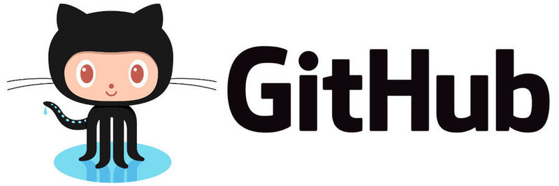

# Taller de Git Hub 2023 The Bridge
   

## Taller de Git Hub realizado para aprender los conceptos básicos de Git Hub.
### En el repositorio tendrás la siguiente información:
- Una [app](https://tallergitthebridge092023.streamlit.app/) hecha con streamlit donde tendrás toda la información relacionada con el taller.
- En caso de que por algun motivo no estuviera operativa la APP siempre tienes un [notebook](https://github.com/svalencia-romero/taller_git_thebridge_09_23/blob/main/notebooks/inicio_git.ipynb) con toda la información del taller pero en formato .ipynb.

### El contenido del taller se puede resumir en lo siguiente:
1. Introducción a GitHub y contenido del taller.
  - ¿Que es Git?,¿que es Git Hub?, diferencias entre ambas] 
  - Primeros pasos en Git Hub, configuración en VSC y creación de repositorio. 
  - Clonar repositorio en VSC  
  - Como añadir nueva información a mi repositorio  
  - Utilización y creación de ramas (branch)  
  - Juntar ramas y actualizar cambios
  - Pull Request, ¿que es y para que sirve? 
  - Resolución de conflictos
    
2. Resumen de lista comandos básicos. 
3. Enlaces a repositorios.
4. Ejercicio practico en grupos.

Realizado por Santiago Valencia Romero, Teacher Assistant.
